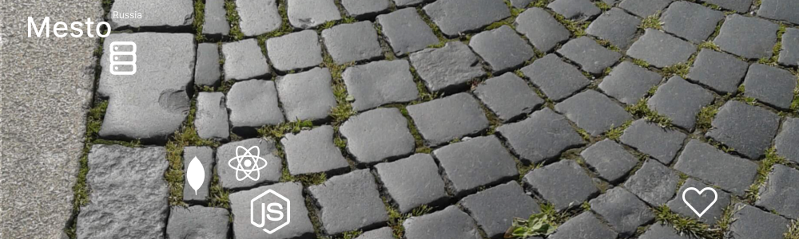

#
 
Адрес репозитория: https://github.com/EliseyE/react-mesto-api-full-gha

## Ссылки на проект

IP 158.160.21.72

Frontend https://mesto.elisey.students.nomoredomains.monster

Backend https://api.mesto.elisey.students.nomoredomains.monster
#

## О проекте
Проект  Mesto - это  одностраничное веб-приложение, в котором можно делиться своими фотографиями с другими пользователями.

Приложение состоит из клиентской и серверной части.

Сервер обработывает запросы со стороны клиентской части приложения, например, той, что была разработана в предыдущих модулях обучения.

Веб-клиент взаимодействует с пользователем, визуализирует данные, принимает и отправляет запросы.

Проект создавался в рамках учебной программы Яндекс Практикум Веб-разработчик. Приложение разрабатывалось в несколько этапов:
* Вёрстка на HTML и CSS;
* Добавление алгоритмов веб-клиента приложения;
* Рефакторинг веб-клиента приложения на ООП и использование Webpack;
* Рефакторинг веб-клиента приложения на React;
* Добавление веб-клиенту приложения регистрации, аутенфикации, авторизации;
* Создание сервера на NodeJS и express;
* Добавление серверу фунций регистрации, аутенфикации, авторизации;
* Согласование серверной и клинтской частей и деплой проекта с настройкой сервера. 

## Технологии

* Web-Client: HTML, CSS, JavaScript, JSX, React

     

* Server: NodeJS and express, DB: MongoDB

    
     

## Функциональность
Пользователь веб-приложения может:
* Зарегистрироваться;
* Авторизоваться;
* Просматривать фотографии других пользователей;
* Лайкать фотографии;
* Добавлять и удалять свои фотографии;
* При закрытии страницы авторизация остаётся активной, можно вернуться без входа в аккаунт, а по неоходимости выйти;
* Предусмотрена валидация, обработка запросов и ошибок.

## Планы
Продолжить разработку: рефакторинг кода в целях улучшения масштабируемости.